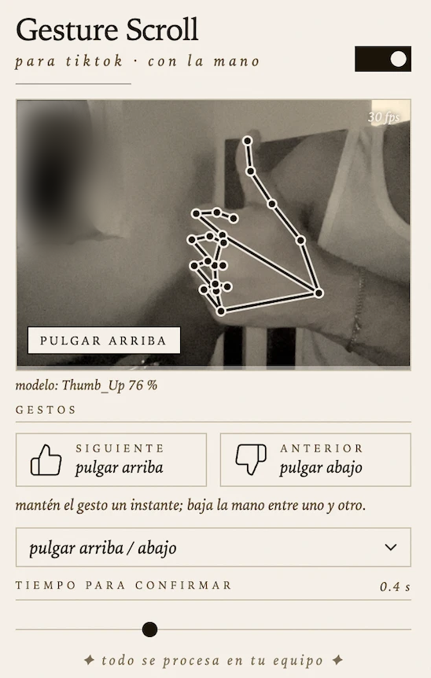

# tiktok-gesture-scroll

pasa de video en tiktok con un gesto de la mano frente a la webcam. extensión para chrome, edge y brave, en windows y macos.



## como funciona

mantén un gesto unos 0.4 s y cambia de video una sola vez. no hay que mover la mano rápido: los swipes fallaban demasiado (la mano se desenfoca al moverse y el seguimiento se pierde), así que ahora los gestos son poses estáticas.

| gesto | acción |
|---|---|
| pulgar arriba (por defecto) | siguiente video |
| pulgar abajo (por defecto) | video anterior |
| dos dedos hacia arriba (opción) | siguiente video |
| dos dedos hacia abajo (opción) | video anterior |

el gesto se elige en el popup. baja la mano un momento entre gestos: hasta que dejas de ver el gesto (unos 0.35 s) no se puede disparar otra vez.

- [mediapipe gesture recognizer](https://github.com/google-ai-edge/mediapipe) saca 21 puntos de tu mano y clasifica la pose. "dos dedos" usa reglas propias sobre esos puntos (índice y medio estirados, anular y meñique doblados, y hacia dónde apuntan), porque el clasificador oficial no la tiene.
- tolera fotogramas perdidos (hasta 0.2 s) y no dispara si el gesto solo aparece de pasada.
- el popup te muestra en vivo lo que ve: el gesto, una barra de confirmación, los fps y lo que responde el clasificador ("modelo: Thumb_Up 92 %"). si algo no dispara, ahí se ve por qué.
- todo corre en tu equipo. el modelo y el runtime wasm vienen dentro de la extensión y no hace ninguna llamada de red. la cámara solo se enciende mientras haya una pestaña de tiktok abierta y la extensión esté activada.

## instalar

**con el zip de la release**
1. baja `tiktok-gesture-scroll-0.2.1.zip` de [releases](../../releases) y descomprímelo.
2. abre `chrome://extensions` (o `edge://extensions`), activa el modo desarrollador y usa **cargar descomprimida** sobre la carpeta.
3. abre el popup de la extensión, activa el interruptor y da permiso a la cámara.
4. abre tiktok.com.

**desde el código**
```bash
npm install
npm run setup    # copia el runtime de mediapipe y baja el modelo (verifica sha256)
npm test
```
y carga la carpeta `extension/` como en el paso 2.

## ajustes

- **gestos**: pulgar arriba/abajo o dos dedos arriba/abajo.
- **tiempo para confirmar** (0.2 a 0.8 s): cuánto hay que mantener el gesto. menos = más rápido pero más disparos por error.

## permisos

`offscreen` y `storage`, acceso a `www.tiktok.com` y la cámara. nada más.

## limites

- solo `www.tiktok.com` y navegadores chromium (chrome 116+, edge, brave). firefox y safari no.
- si tiktok cambia su html, la extensión cae a simular la tecla flecha, que puede no funcionar.
- solo navega la pestaña de tiktok que está activa, nunca una en segundo plano.
- con poca luz o una cámara mala la detección empeora. los gestos con pulgar dependen del clasificador de mediapipe, que suele fallar más con el pulgar abajo; si te falla, usa "dos dedos".
- probado: 20 tests del detector de gestos (con pruebas de mutación) y la extensión completa en chrome 153 sobre macos, con una cámara simulada que reproduce una foto real de una mano (dos dedos arriba, ausencia, dos dedos abajo, ausencia) contra el feed real de tiktok: un `siguiente` y un `anterior` por ciclo, sin disparos extra, y el feed avanzó un video por gesto.
- con una webcam real se comprobó que se reconocen "dos dedos" y "pulgar arriba" (la captura de arriba: `Thumb_Up` 76 %, 30 fps en un macbook). el pulgar abajo no se ha probado con una mano real, y el cambio de video con los gestos de pulgar solo se probó con la cámara simulada. no probado en windows. el ci corre los tests del detector en macos, windows y linux.

## desarrollo

```
extension/      lo que se carga en el navegador
  gesture.js    clasificacion de poses y deteccion de "mantener", logica pura
  offscreen.js  camara + mediapipe
  background.js, content.js, popup.*
test/           tests del detector (node --test)
scripts/        setup, icons, pack
```

`npm run pack` deja el zip en `dist/`.

## licencia

mit. mediapipe y su modelo son de google, ver [THIRD_PARTY_NOTICES](extension/THIRD_PARTY_NOTICES.md). no estoy afiliado a tiktok.
